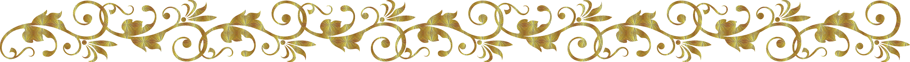

# Архитектура CSDR

<h3>Предисловие</h3>

За всё время работы программистом, я сталкивался с различными задачами по доработке сайтов. И отметил одно: функций много, по разных файлам разбросанно, общей картины пространства имён не видно, где то (например в yii) нужно ещё инициировать проект, чтобы через phpmyadmin увидеть актуальные таблицы... я не говорю уже о контроле созданного проекта, который не централизован вовсе (if,elseif где попало). А перевод на git технологии перевёл код на уровень: построили из того что было под рукой.

PHP-коды по методу  "ООП на классах" я выявил как некие зависания в каких то (не ясных) этапах разработок. Вы смотрели "<a href="https://www.youtube.com/watch?v=fqWQ2tePQk8">Фирма, которая занимается ничем</a>"? Раздрай какой то:

1. Цели и ориентиры проекта отстуствуют
2. Пространство имён и файлов неструктурировано
3. Связи на отдачу информации отсутствуют
4. Алгоритмы, разные по своему назначению, уравниваются

Аки твёрдой земле, которая вообще не впитывала землю, последствия у html-программирования не лучше:

1. В ней нет возможности выстроить единства тэгов со скриптами в виде событий на них (упущена последовательность JS: 1. выстроить DOM, 2. установить события, 3. инициировать авто-события)
2. В ней нет возможности выстроить единый шаблон на все страницы (упущена многовариантность DOM, например в таком то тэге может быть как DIV, так и TABLE)
3. В ней нет возможности сделать тэги самоклонированными (упущена возможность отметить, что например TR с содержимым может повторяться при заполнении его значениями)

<h3>Свобода как осознанная необходимость</h3>

Оперевшись на <a href="https://github.com/it-architector/framework.life-balance">framework.life-balance</a>, я начал восстанавливать исконный подход к программированию, да так, чтобы <b>можно было легко сдать сайт другому программисту на доработку, со всем необходимым</b>, как игроки по скайпу передают сохранялки к игре.

Итерфейс же я хотел видеть как трансформер, где html вполне управляем и подвижен.

В итоге должен состояться исконный подход к программированию, сопрождающий построение проекта (ядра, интерфейса, сайта), и не дозволяющий неприемлимое. 

<h2>Архитектура</h2>

<h3>Согласование</h3>

По моим расчётам (и подсказкам таки еврейских братьев) наш мир 4-х-мерный: прошлое (наша опора), будущее (наша среда), объединяющее (таки да, торговля и подарки важны) и настоящее (наши дела). Основавшись на таких знаниях, и признав, что лучшего программирования согласованного с ходом нашего времени, для моих устремлений, не найти, я утвердил, что итоговый проект (ядра, интерфейса, сайта) должен вмещать в себя: 

1. Права
2. Роли
3. Возможности + приобретения
4. Способности

И ничего более, или менее.

<h3>Проектирование</h3>

Далее для проекта я спроектировал имена компонентов: Conditions, Space, Distribution и Realization. В них и будут создаваться всё необходимое для проекта. Зафиксируем это как аббревиатуру CSDR. 

Для удобства изъяснений, сделаю общую картину проекта и перевод:

1. Conditions, где создаются права проекта -> <b>Рефлексы</b>

2. Space, где создаются роли проекта -> <b>Места</b>

3. Distribution, где создаются возможности и приобретения проекта -> <b>Связи</b>

4. Realization, где создаются способности проекта -> <b>Реакции</b>

<h3>Объект</h3>

При просмотре всех рефлексов мы можем понять, какие внешние события проект обрабатывает, по простому: для чего проект существует.

При просмотре мест, мы можем понять, какие у проекта функции, оболочки, переменные и их значения.

При просмотре связей, мы можем понять, как заполняется и куда поступают значения переменных.

При просмотре реакций, мы можем понять, логику проекта.

<h2>Ядро</h2>

<h3>Проект</h3>

Когда же из компонентов начал создавать 4-х-мерный проект ядра, то заметил, что рефлексы и места из за своих особенностей (необходимости вложенности) должны выстраиваться гомоархически (в субъекты), а вот связи и реакции гетерархично (в объекты) по причине завязки на места.

<h3>Содержание</h3>

Для каждого компонента так же было выявлено необходимое содержание, дабы каждый компонент смог раскрыть себя полностью и быть применим на любом уровне проекта.

Для <b>рефлексов</b>:
1. Ориентир, где идёт обозначение рефлекса
2. Условия, где код условия ("if")
3. Расчёты, где идёт описание рефлекса
4. Места, где перечисляются id мест для активации
5. Вложение, подкатегории рефлексов

Для <b>мест</b>:
1. Смысл, где идёт обозначение места
2. Роль, где идёт назначение места
3. Связи, где перечисляются id связей для активации
4. Вложение, подкатегории мест / значение

Для <b>связей</b>:
1. Возможности, где перечисляются id мест (с ролью "Информация") для импорта вложений в реакцию
2. Приобретение, где перечисляются id мест (с ролью "Информация") для экспорта результата из реакции во вложения
3. Пример возможностей, для тестирования алгоритма
4. Пример приобретения, для тестирования алгоритма
5. Реакция, где перечисляются id реакций для активации

Для <b>реакций</b>:
1. Способность, где алгоритм

<h3>Взаимосвязь</h3>

Далее я связал компоненты в взаимную последовательную активацию:

1. Реакции активируют рефлексы
2. Рефлексы активируют места
3. Места активируют связи
4. Связи активируют реакции
и т.д. с самого начала, до тех пор пока есть не активированные рефлексы.

<h3>Пример</h3>

И вот, всё необходимое для реализации учтёно. Приступим.

Установим цель примера, например такую: на внешний запрос "x" и "y" выдать результат "z", рассчитанный по формуле x + y = z.

Сконструируем проект (стрелками обозначим влияние / активацию):

Итог: <a href="./Код ядра на PHP.php">Код ядра на PHP</a>.

<h2>Интерфейс</h2>

<h3>Трансформация</h3>

Давайте взглянет на трансформацию в природе!

<b>1. Объект "Семя"</b>
Получаем java-script-код (и никаких html-тэгов, кроме <script>).

<b>2. Главная цель</b>

Получаем цели.

<b>3. Главное место</b>

Выстраиваем DOM.

<b>4. Место запаса</b>

Запоминаем глобальные переменные.

<b>5. Верхне-нижнее место</b>

DOM дополняется новыми отделами.

<b>6. Элемент</b>

Задаем на местах необходимый обмен (входящее-выходящее) с глобальными переменными.

<b>7. Событие</b>

На элементы выставляем необходимые события.

<b>8. Объект "Дерево"</b>

Отображаем интерфейс в браузере!

<h3>Многостраничность</h3>

Поглядим на корни. Это будут наши рефлексы. Новые корни (под-рефлексы) будем отмечать новым цветным окрасом. Соотвестенно, все места (и элементы, и события) так же будут помечены таким же цветным окрасом того рефлекса, которой принадлежат. Это позволит при активации определенного рефлекса создать нужные места (и связи, и реакции).

На картинке задана первый рефлекс, который мы обязательно выполним: вырастим ветку (создадим TR), а потом уже на выбор, активируем одно из рефлексов: либо TH, либо TD (которые впоследствии заполним содержимым).

<h3>Самоклонирование</h3>

Отметим штрихами то место, которому нужно самоклонироваться. Это место будет наш тэг TD. Создадим на это место связь, которое подгрузит массив данных для всех TD, который реакция распределит.

<h3>Пример</h3>

Выведим два тэга (div, b) и заполним один тэг текстом: <a href="./Код трансформации интерфейса на JS.html">Код трансформации интерфейса на JS</a>.

<h2>Ссылки</h2>

Далее по теме: 

 <a target="_blank" href="https://github.com/it-architector/core.csdr">Ядро на PHP посредством архитектуры CSDR</a> 
 <a target="_blank" href="https://github.com/it-architector/interface.csdr">Интерфейс на JS посредством архитектуры CSDR</a> 
 <a href="https://money.yandex.ru/to/410013830829482/500000">Мой баланс (не трусьте, пополняйте!)</a>

Публикации:

 <a target="_blank" href="https://php.ru/forum/threads/arxitektura-proekta-na-php.81428/">На php.ru</a> 
 <a target="_blank" href="http://www.cyberforum.ru/php-frameworks/thread2527421.html">На cyberforum.ru</a> 
 <a target="_blank" href="https://habr.com/ru/post/474296/">На habr.com</a> 

